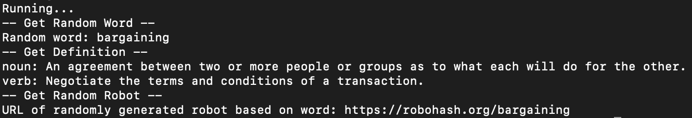
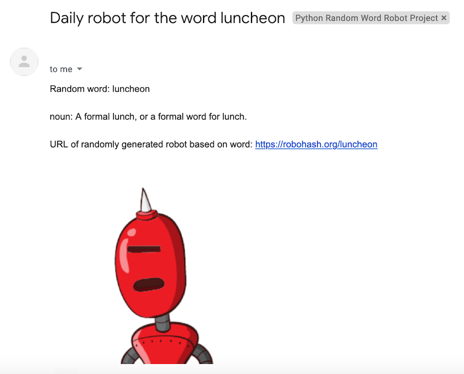

# Random Word and Robot Generator
A project made for fun with the goal to get a random word with the definition, using robohash to generate a unique robot for the word. 

Using https://random-word-api.herokuapp.com/home for requesting random words, the (unofficial) Google Dictionary API at https://dictionaryapi.dev/ for definitions, and robohash for uniquely generated robots at https://robohash.org/.

## Notes

The file ```random_word_robot_commandline.py``` simply prints out all of the information gathered in the script.
```random_word_robot_public.py``` and ```send_email_public.py``` are available for anyone to download and to run in order to email the information to any email. A gmail account and password are required, with the 'Less secure app access' setting turned on. Learn more here: https://support.google.com/accounts/answer/6010255?hl=en

On a private computer and on PythonAnywhere, modified versions of ```random_word_robot_public.py``` and ```send_email_public.py``` are present with personal account details. PythonAnywhere allows the program files to be accessed and run from anywhere online. However, App Passwords must be used when on PythonAnywhere: https://support.google.com/accounts/answer/185833?hl=en. It seems like Google requires a more secure login when that attempting to do so via a cloud service than doing so with regularly, such as with home internet. Moving forward, the local modified version is used for debugging and further testing. The public files are available for general use, which is why ```send_email_public.py``` must be modified with account details on line 11 and 12 if used by other users.

Please download and run the scripts at your own discretion. Again, this project was simply made for fun and for personal use!

## Usage
To run this project, download the files and navigate to the project files.
1. Open a terminal or command prompt window
2. ```cd``` into the root folder
3. Run ```source ./env/bin/activate```
4. Check for (env) to confirm that the Python environment (with all required packages) has properly loaded in 
5. Run ```python3 random_word_robot_terminal.py``` to run the Python file

## Output
The following image shows an example of what the output of this program looks like in the command line.



The following image shows an example of what robohash has generated based on the random word that was received from the api. See the image here as well: https://robohash.org/bargaining


The following image shows an example of what the output of this program looks like as an email.



## Automation
As an extension, automated emails can be achieved by using Automator and Calendar on any Mac. The simplest way is by creating a new ```Calendar Alarm``` in Automator, and then using Run Shell Script with the following shell commands (they can be pasted in, with each command on a new line):
1. ```cd``` into the root folder of this project (for example: ```cd /Users/username/Desktop/PythonProjects/random-word-robot-python``` )
2. ```source ./env/bin/activate``` 
3. ```python3 random_word_robot.py```

Finally, change the desired start time and how often the script should repeat in Calendar.
Once all of these steps are complete, emails should send automatically as per Automator and Calendar's respective capabilities.
